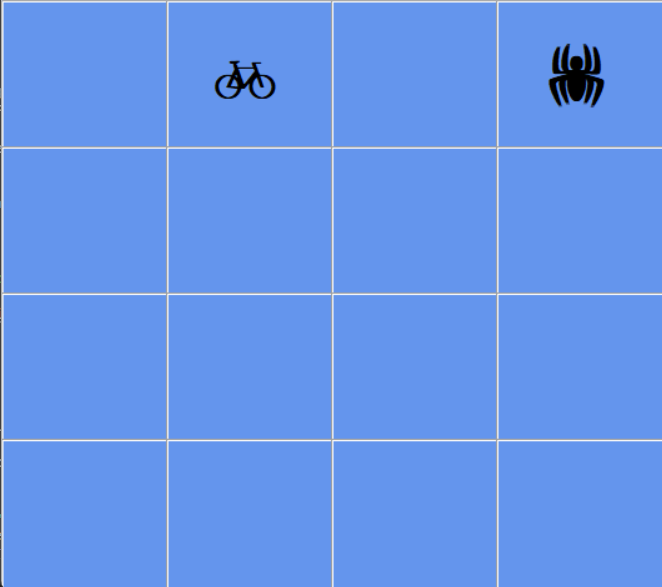
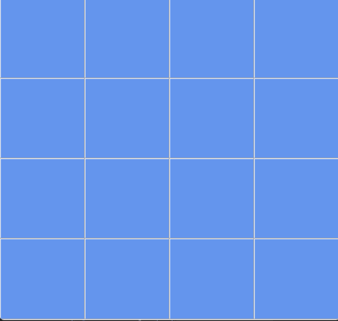

# 🧠 Matching Game — Jeu de Memory en C# (WinForms)

Un jeu de memory classique développé en C# avec Windows Forms : retrouvez les paires d'icônes identiques cachées derrière une grille, le tout chronométré en temps réel.

---

## 📋 Sommaire

- [Aperçu](#-aperçu)
- [Fonctionnalités](#-fonctionnalités)
- [Démo](#-démo)
- [Technologies utilisées](#-technologies-utilisées)
- [Prérequis](#-prérequis)
- [Comment jouer](#-comment-jouer)
- [Fonctionnement technique](#-fonctionnement-technique)
- [Auteur](#-auteur)

---

##  Aperçu

Ce projet est un jeu de memory (matching game) à 16 cases (8 paires) sous forme de grille de `Label` dans une `TableLayoutPanel`. Le joueur clique sur deux cases pour révéler leur icône ; si elles correspondent, la paire reste visible et le score augmente. Sinon, les deux cases se recachent automatiquement après un court délai.

Un chronomètre affiche le temps écoulé en temps réel pendant toute la partie.

---

##  Fonctionnalités

- Grille de 16 cases générée dynamiquement (8 paires d'icônes placées aléatoirement)
- Système de sélection à deux clics (première case / deuxième case)
-  Détection automatique des paires correctes et incorrectes
-  Chronomètre en temps réel (secondes écoulées depuis le début de la partie)
-  Message de victoire avec le temps final une fois les 8 paires trouvées

---

## Démo

+ Gameplay  :                     

 

## 🛠️ Technologies utilisées

- **Langage** : C#
- **Framework** : .NET (Windows Forms)
- **IDE** : Visual Studio
- **Composants WinForms** : `TableLayoutPanel`, `Label`, `Timer`, `MessageBox`

---

## ✅ Prérequis

- [Visual Studio](https://visualstudio.microsoft.com/) (2019 ou plus récent) avec la charge de travail **"Développement .NET Desktop"**
- .NET Framework ou .NET (selon la version du projet)

---

## 🕹️ Comment jouer

1. Clique sur une première case pour révéler son icône
2. Clique sur une deuxième case
3. Si les deux icônes correspondent → la paire reste visible et ton score augmente
4. Si elles ne correspondent pas → les deux cases se recachent automatiquement après un court délai
5. Trouve les **8 paires** le plus vite possible pour terminer la partie

Le temps écoulé s'affiche en continu ; à la fin, un message indique ton temps total.

---

## ⚙️ Fonctionnement technique

### Génération de la grille

Chaque `Label` de la `TableLayoutPanel` reçoit une icône tirée aléatoirement d'une liste où chaque icône apparaît deux fois. L'icône est masquée en donnant au texte la même couleur que le fond (`ForeColor = BackColor`).

### Logique de sélection

Tous les `Label` partagent le même gestionnaire d'événement `Click` (`label1_Click`). Le paramètre `sender` permet d'identifier précisément quel `Label` a été cliqué. Deux variables (`first_click` et `second_click`) suivent l'état de la sélection en cours :

- 1er clic → stocké dans `first_click`, icône révélée
- 2e clic → stocké dans `second_click`, icône révélée
- 3e clic (sur une autre case) → comparaison des deux textes ; si identiques, le score augmente et les deux cases restent révélées, sinon un `Timer` les recache après un court délai

### Chronomètre

Un `Timer` dédié (`timerClock`, intervalle de 1000 ms) incrémente un compteur de secondes à chaque tic, indépendamment de la logique de clic. Il s'arrête automatiquement lorsque toutes les paires sont trouvées.

---

## 👤 Auteur

Développé par **Nourane** 

